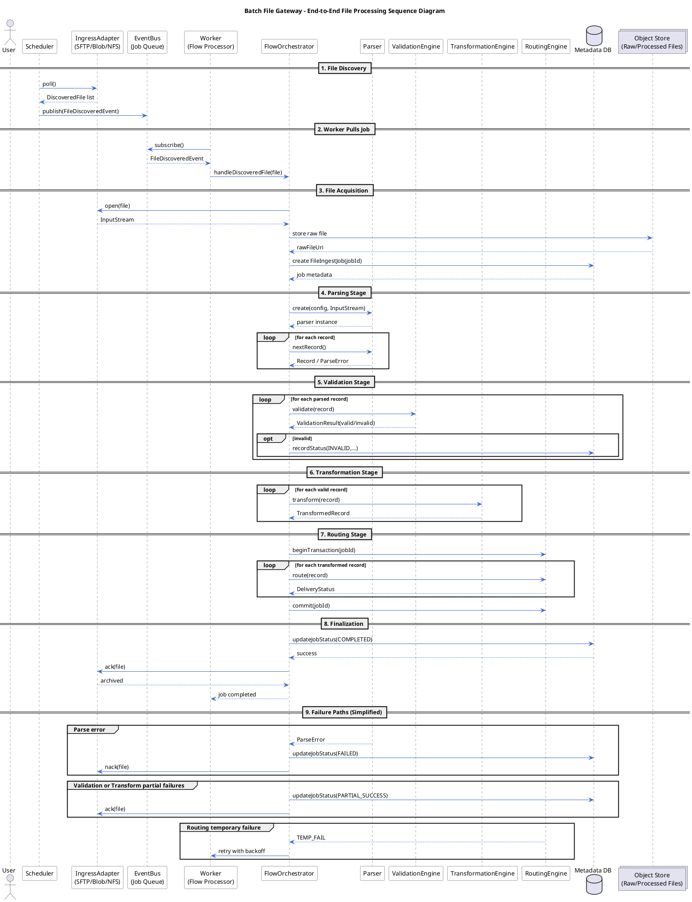

Below is a **MAANG-grade, fully accurate PlantUML Sequence Diagram** for the **End-to-End File Lifecycle** of your **Batch File Gateway / File Flow Manager**.

It covers:

* Scheduler
* Ingress Adapter
* Orchestrator
* Parser
* Validation Engine
* Transformation Engine
* Routing Engine
* Metadata DB
* Object Store
* Event Bus
* Final ACK/NACK

This is **copy-paste ready** for VS Code, PlantText, Eraser, or any PlantUML tool.

---

# ✅ **PLANTUML — END-TO-END FILE PROCESSING SEQUENCE DIAGRAM**

---

# 🔥 What This Sequence Diagram Covers

### ✔ COMPLETE PIPELINE

✓ Discovery
✓ Event creation
✓ Worker execution
✓ Parsing
✓ Validation
✓ Transformation
✓ Routing
✓ Finalization
✓ ACK/NACK
✓ Failure & retry paths

### ✔ CORRECT PARTICIPANTS (Industry Standard)

* Scheduler
* Adapter
* Object Store
* Event Bus
* Worker
* Orchestrator
* Parser, Validator, Transformer, Router
* Metadata DB

### ✔ MODELED AS STREAMING PIPELINE

Not “load entire file” — accurate to high-performance engines.

### ✔ Enterprise-grade reliability behaviors

* Partial success
* Retry loops
* Dead-letter handling
* ACK/NACK semantics
