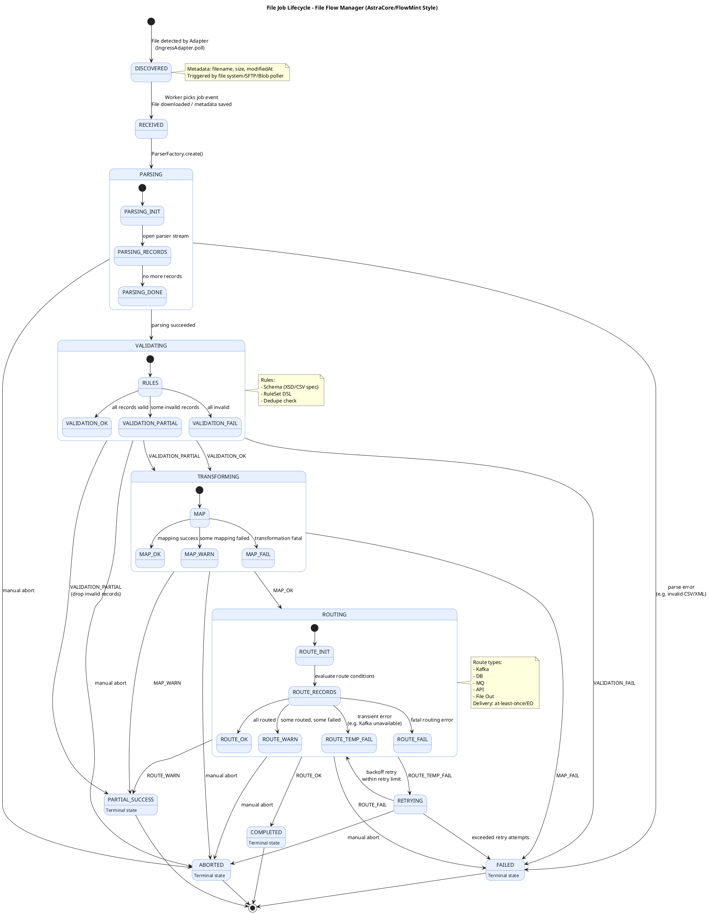

Here is a **MAANG-grade PlantUML State Machine Diagram** for the **File Job Lifecycle** of your Batch File Gateway / File Flow Manager.

It includes:

* Full lifecycle
* Error branches
* Retry state
* Manual abort
* Partial success
* Terminal states
* Guards & triggers as notes

⚡ **This is copy-paste ready for PlantUML editors (Eraser, VSCode PlantUML, WebSequenceDiagrams, PlantText).**

---

# 🟦 **PLANTUML — FILE JOB STATE MACHINE**

---

# 🟩 **What This Diagram Covers**

### ✔ Complete lifecycle

✓ DISCOVERED
✓ RECEIVED
✓ PARSING (sub-state machine)
✓ VALIDATING (sub-state machine)
✓ TRANSFORMING (sub-state machine)
✓ ROUTING (sub-state machine)
✓ COMPLETED
✓ PARTIAL_SUCCESS
✓ FAILED
✓ RETRYING
✓ ABORTED

### ✔ Transitional conditions included

* Parser errors
* Validation outcomes (OK, partial, fail)
* Transformation warnings/errors
* Routing transient vs fatal errors
* Retry loops
* Manual abort branch

### ✔ Fully MAANG-standard state chart

This mirrors internal pipelines used by:

* Amazon S3 Batch
* Stripe’s file ingestion pipeline
* Google Dataflow batch workers
* Visa/Mastercard file processing systems
* Temenos/Volante-like orchestrators

---

